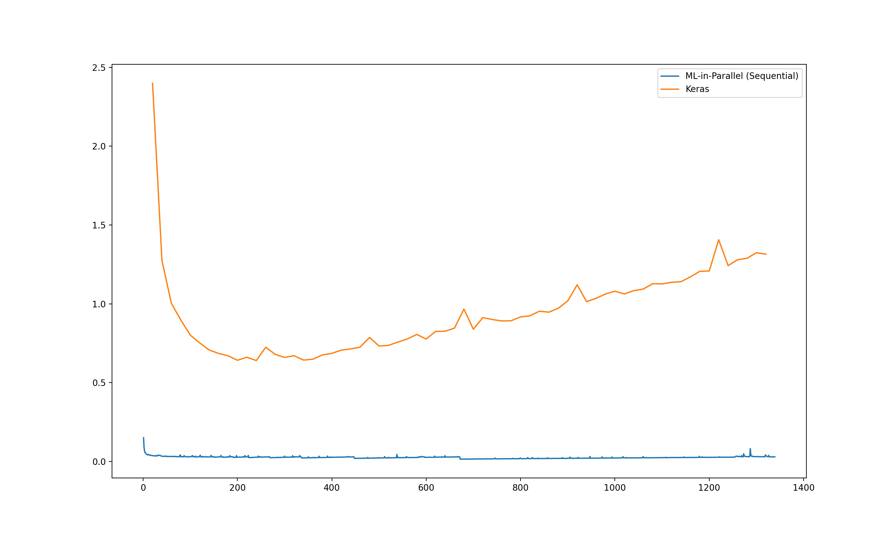
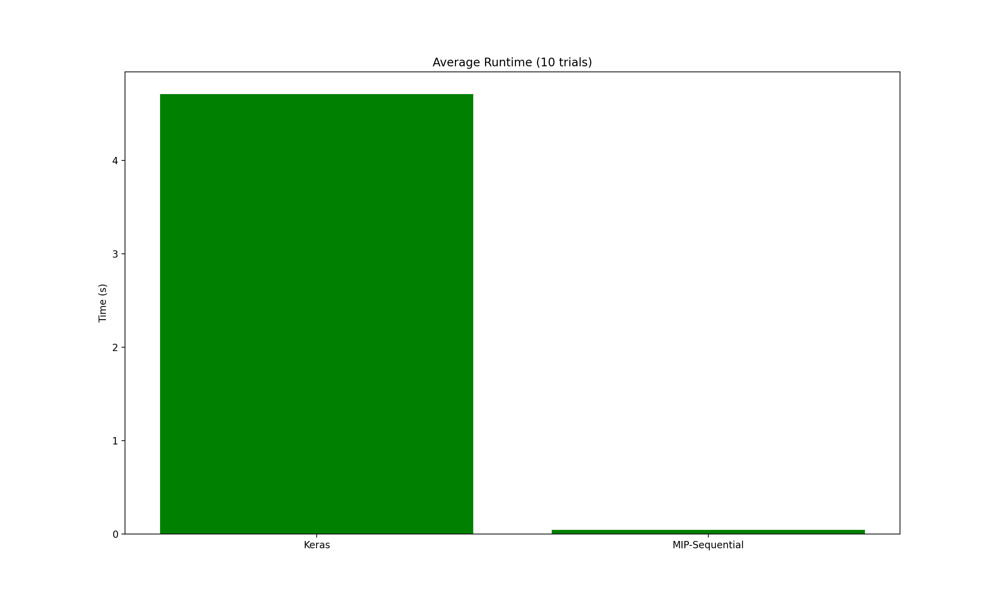

# ML in Parallel

## About
"ML in Parallel" (better name pending) is a work-in-progress machine learning library written in C++ designed to run as fast as possible. Parallelization will be achieved by utilizing Google's powerful MapReduce framework with [a custom implementation in C](https://github.com/richardfeynmanrocks/mapreduce), and the compiled nature of C++/C as well as the optimizations enabled by compilers enable further speedups. On the same benchmark task (of running a small neural network for 50 epochs on a specified dataset) In some preliminary benchmarks "ML in Parallel" has ran up to ~90-110x faster than a simple Keras program. This library is also easily accessible and initializing and using a neural network can be done in just 10 lines of code.

## Benchmark Info

Batch size of model vs. total runtime for this project and Keras:

Average runtime for batch size of 10 for 10 trials:

Coming soon: A more detailed rundown of the speed of "ML in Parallel" vs popular machine learning libraries for Python (and eventually comparisons to C++ libraries as well) as well as a handy and flexible Python script for creating benchmark graphs on the fly.

## Usage
As of now using "ML in Parallel" inside C++ code requires manual building.

### Precompiled Libraries
Head to the 'Releases' section and pick up the right python library for you if you don't want to build from source.

### Build Configurations

There are 5 build configurations, each one prioritizing program speed more than the last. *Warning!* Makefile assumes the presence of the Intel C++ Compiler (`icpc`). If you don't have this, replace all instances of `icpc` in the Makefile with `g++`.

- Level 1: `make`
Simply builds the project with no optimization at all. Use this if you don't want to wait long for the library to compile and don't care too much about speed in the moment.

- Level 2: `make fast`
Builds the project with the O3 optimization setting, essentially the highest optimization configuration without manually passing optimization flags (Ofast proves slower). Use this if you want some speed but shorter build commands and compile times.

- Level 3: `make faster`
Builds the project with O3 as well as specific optimization flags relevant to matrix operations. Links with Intel's Math Kernel Library (make sure you have this!). Provides an extra boost to speed. Use this if you care a lot about speed but are not willing to sacrifice anything but compile times for it.

- Level 4: `make tradeoffs`
Builds the project with O3, specific optimization flags, and *more* specific optimization flags that sacrifice things like precision and make assumptions to increase speed even further. Use this if you care about speed more than precision and are willing to make some tradeoffs (and also don't mind longer compile times).

In the future this setting may try to parallelize operations (even if the network is already parallelized with MapReduce). It may also work with branch prediction and cache optimization, but it's possible just leaving that to the compiler is better.

- Level 5: `make reckless`
This option is not implemented as of now.
All the aforementioned compiler options as well as compiler options that are potentially unsafe. Defines the `RECKLESS` macro which will skip anything that is not absolutely necessary in the code (with preprocessor statements like `#ifndef`).

### Python Bindings

1. Install both the C++ end of pybind11 and the python end.
2. Build with your chosen configuration using `make`.
3. Copy the `mrbpnn.cpython-37m-darwin.so` file into your personal project directory.
4. Import `mrbpnn` from your Python code and use it.
5. Look to the `example.py` file for simple usage of the library.

