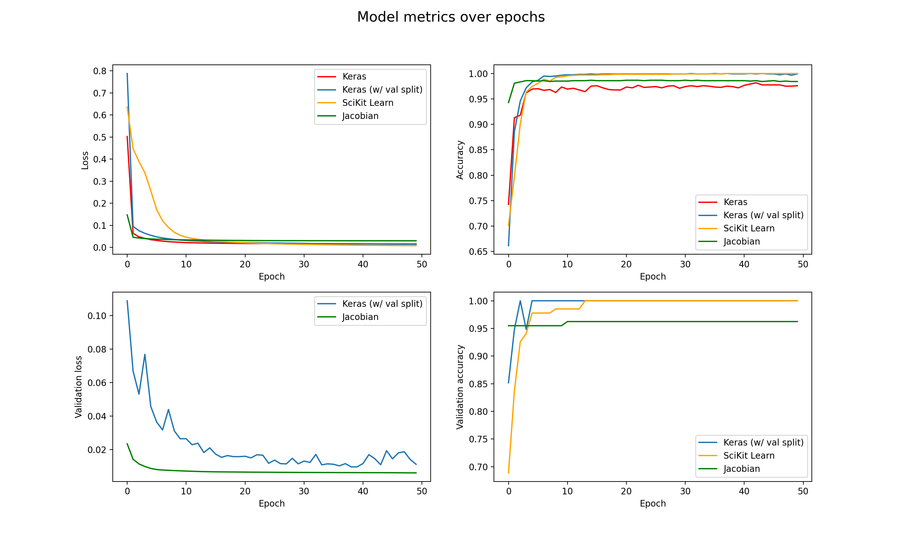
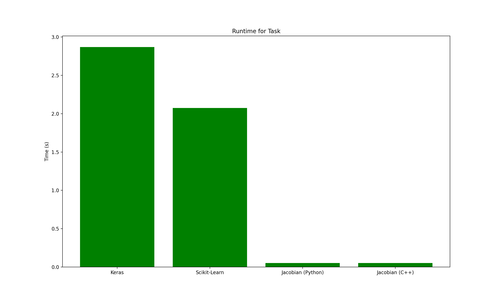

  <!-- readme.md -->
  <!-- Jacobian -->

  <!-- Created by David Freifeld -->


## About
Jacobian is a work-in-progress machine learning library written in C++ designed to run as fast as possible while still being simple to use. Jacobian is accessible via Python and enables you to write models that train faster with the same amount of code. As of now, Jacobian supports feedforward neural networks and has partial support for convolutional neural networks. ***Note that as Jacobian is a work-in-progress, the latest commit is and will be largely unstable until this README specifies otherwise.***

## The Chopping Block
What's next for Jacobian?

1. **Full AVX support.** This will make time-consuming parts of the code like activation functions (most notably softmax) and coefficient-wise multiplications 2-4x faster. This will only work on processors supporting AVX instructions.

2. **Usable CNNs.** CNNs have been supported for a bit now, but in their current state have not been very practical or stable. Fixes and additions to the CNN backprop, proper pooling layer support, and tensors will enable CNNs to behave more like their stable ANN brethren. Expect small CNN-oriented features as well.

3. **Parallelism.** Running multiple networks in parallel was once supported but has since stopped working. This feature plus the ability to paralellize a singular network will finally allow Jacobian to live up to its original purpose of being a parallel ML library.

**The farther future** may hold initial implementations of RNN-like architectures, GPU support/optimizations, transfer learning, and autodifferentiation a la PyTorch.

**Some smaller features** coming up may include a proper Python install via `pip`, more complex gradient descent optimizers, proper sanity/gradient checks, and more in-depth benchmarks.

## Benchmarks

One of the tradeoffs of Jacobian is that as of now it doesn't train nearly as close to perfection as other available libraries nor does it maximize accuracy as much (with the benefit being the added speed). Here's a graph of Jacobian's model metrics over epochs on a simple task (banknote dataset with batch size 16) as compared to other libraries.



Here's a runtime comparison for a simple example task (same as before) between Jacobian and some other popular ML libraries:



**Coming soon:** A more detailed and current rundown of the speed of Jacobian vs popular machine learning libraries for Python (and eventually comparisons to C++ libraries as well) as well as a handy and flexible Python script for creating benchmark graphs on the fly.


## Usage

Initializing and training a neural network with Jacobian takes just 8 lines of code!
```python
import mrbpnn
net = mrbpnn.Network("../data_banknote_authentication.txt", 10, 0.01, 0.001, 0.5, 0.75)
net.add_layer(4, "linear")
net.add_layer(10, "lecun_tanh")
net.add_layer(1, "linear")
net.initialize()
for i in range(50):sr
  net.train()
```

### Rundown
What's happening in those seven lines?

First, call the Network constructor (from henceforth all functions will be presented in their C++ form). This is where many of the hyperparameters are defined, and you'll need to pass in the path to your data, the desired batch size, learning rate, bias learning rate (which should usually be smaller), regularization strength, and train-val ratio.
```c++
Network(char* path, int batch_sz, float learn_rate, float bias_rate, float l, float ratio);
```

Then add your layers one by one, similar to Keras. You'll need to specify how many neurons there are in the layer and the layer's activation.
```c++
void add_layer(int nodes, char* activation);
```
Optionally, one can overwrite the activation of a layer with their own function:
```c++
void set_activation(int index, std::function<float(float)> custom, std::function<float(float)> custom_deriv);
```
At this point could also specify a learning rate decay function as well by calling `init_decay`.
```c++
void init_decay(char* type, float a_0, float k);
```
Next, call `initialize()` to initialize the network's weights.
Finally, train your network for one epoch with `train()`. Training one epoch at a time allows you control over the accuracy reporting (with functions like `get_cost()`, `get_accuracy()`, `get_val_cost()`, and `get_val_accuracy()`) and also allows effective use of services like W&B.

### Examples
In the `/scripts` directory there is an example of a neural network being used in conjuction with Weights & Biases, allowing for effective hyperparameter searches and accuracy reporting.

## Building

### Main Steps
Note: This is all ideally the process for manual building, but it's so confusing that I'm not sure. You're better off manually copying the .so file!
1. Install the C++ library Eigen.
2. Install the C++ and python ends of the pybind11 library.
3. Run `make` with the configuration of your choosing.
4. Run `python setup.py bdist_wheel`
5. `cd` into `dist` and run `python3 -m pip install --upgrade Jacobian-1.0-cp37-cp37m-macosx_10_13_x86_64.whl`
6. Be unhappy when it doesn't work out and resort to just copying .so files.

### Build Configurations (Building from Source)

There are 5 build configurations, each one prioritizing program speed more than the last. **NOTE:** These options change very frequently as I experiment, so this describes the features that have remained generally invariant.

#### Level 1: `make`
Simply builds the project with no optimization at all. Use this if you don't want to wait long for the library to compile and don't care too much about speed in the moment.

#### Level 2: `make fast`
  - Builds the project with the O3 optimization setting.

Use this if you want some speed but shorter build commands and compile times.

#### Level 3: `make faster`
Enables extra optimizations, some of which include:
  - Building the project with O3.
  - Optimizing for native architecture.

  Use this if you care a lot about speed but are not willing to sacrifice anything but compile time for it.

#### Level 4: `make tradeoffs`
Some of the new compiler optimizations include:
   - Enabling the `-ffast-math` flag.

In the future this setting may try to parallelize operations (even if the network is already parallelized with MapReduce).

#### Level 5: `make reckless`
- Defines the `RECKLESS` macro which skips checks anywhere in the program.
