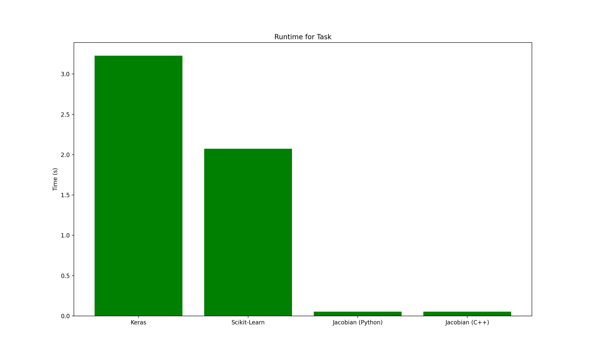

## About
Jacobian is a work-in-progress machine learning library written in C++ designed to run as fast as possible. Parallelization will be achieved by utilizing Google's powerful MapReduce framework with [a custom implementation in C](https://github.com/richardfeynmanrocks/mapreduce), and the compiled nature of C++/C as well as the optimizations enabled by compilers enable further speedups. On the same benchmark task (of running a small neural network for 50 epochs on a specified dataset) In some preliminary benchmarks Jacobian has ran up to ~90-110x faster than a simple Keras program. This library is also easily accessible and initializing and using a neural network can be done in just 10 lines of code.

## Benchmark Info

Batch size of model vs. total runtime for this project and Keras (Keras was slow enough that it moves in steps of 20 and starts at a batch size of 20. In reality, the spike at the beginning is much larger for lower batch sizes but it throws the graph off so much you can't see any detail from MIP):

Average runtime for batch size of 10 for 10 trials:

Coming soon: A more detailed rundown of the speed of Jacobian vs popular machine learning libraries for Python (and eventually comparisons to C++ libraries as well) as well as a handy and flexible Python script for creating benchmark graphs on the fly.

## Usage
This library is relatively fit for some use with python, but as of now using Jacobian inside C++ code requires manual building.

### Precompiled Libraries
Head to the 'Releases' section and pick up the right python library for you if you don't want to build from source.

### Build Configurations

There are 5 build configurations, each one prioritizing program speed more than the last. *Warning!* Makefile assumes the presence of the Intel C++ Compiler (`icpc`) and the Intel Math Kernel Library. If you don't have this, replace all instances of `icpc` in the Makefile with `g++', remove all traces of the Math Kernel Library, and remove the flags `g++` doesn't understand.

#### Level 1: `make`
Simply builds the project with no optimization at all. Use this if you don't want to wait long for the library to compile and don't care too much about speed in the moment.

#### Level 2: `make fast`
  - Builds the project with the O3 optimization setting, essentially the highest optimization configuration without manually passing optimization flags (Ofast can prove slower). 

Use this if you want some speed but shorter build commands and compile times.

#### Level 3: `make faster`
Enables a whole slew of extra optimizations, some of which include:
  - Building the project with O3.
  - Optimizing for native architecture.
  - Instructing compiler to fetch data for CPU cache earlier.
  - Unrolling loops.
  - Links with Intel's Math Kernel Library (make sure you have this!). Provides an extra boost to speed. 
  
  Use this if you care a lot about speed but are not willing to sacrifice anything but compile time for it.

#### Level 4: `make tradeoffs`
Builds the project with O3, specific optimization flags, and *more* specific optimization flags that sacrifice things like portability and precision as well as makes assumptions to increase speed even further. Use this if you care about speed more than precision and are willing to make some tradeoffs (and also don't mind longer compile times).

Some of the new compiler optimizations include:
   - Using an optimized version of `calloc`.
   - Using Intel-specific optimizations.
   - Allowing low-precision alternatives to operations like sqrt and division.
   - Enabling the `-ffast-math` flag.
   - Approximating more complicated functions.

In the future this setting may try to parallelize operations (even if the network is already parallelized with MapReduce).

#### Level 5: `make reckless`
This option is not implemented as of now.

Planned features include:
    - Adding all the aforementioned compiler options as well as compiler options that are potentially unsafe. 
    - Defining the `RECKLESS` macro which will skip anything that is not absolutely necessary in the code (with preprocessor statements like `#ifndef`).

### Python Bindings

1. Install both the C++ end of pybind11 and the python end.
2. Build with your chosen configuration using `make`.
3. Copy the `mrbpnn.cpython-37m-darwin.so` file into your personal project directory.
4. Import `mrbpnn` from your Python code and use it.
5. Look to the `example.py` file for simple usage of the library.

## The Future

Jacobian is actively in development and the following are things that are planned for the nearish future:
    - More architectures such as Convolutional Neural Networks and RNN-like architectures (LSTM, GRU...).
    - Moving towards a more proper release by emphasizing usability.
    - Further increasing speedups from a conceptual perspective with better algorithms, a implementation perspective with optimized code, and a low-level perspective with hardware optimizations + more compiler work.
    - More advanced capabilities such as the inclusion of gradient descent optimizations.
    - More clear examples on how this is used as well as why one would use it.
